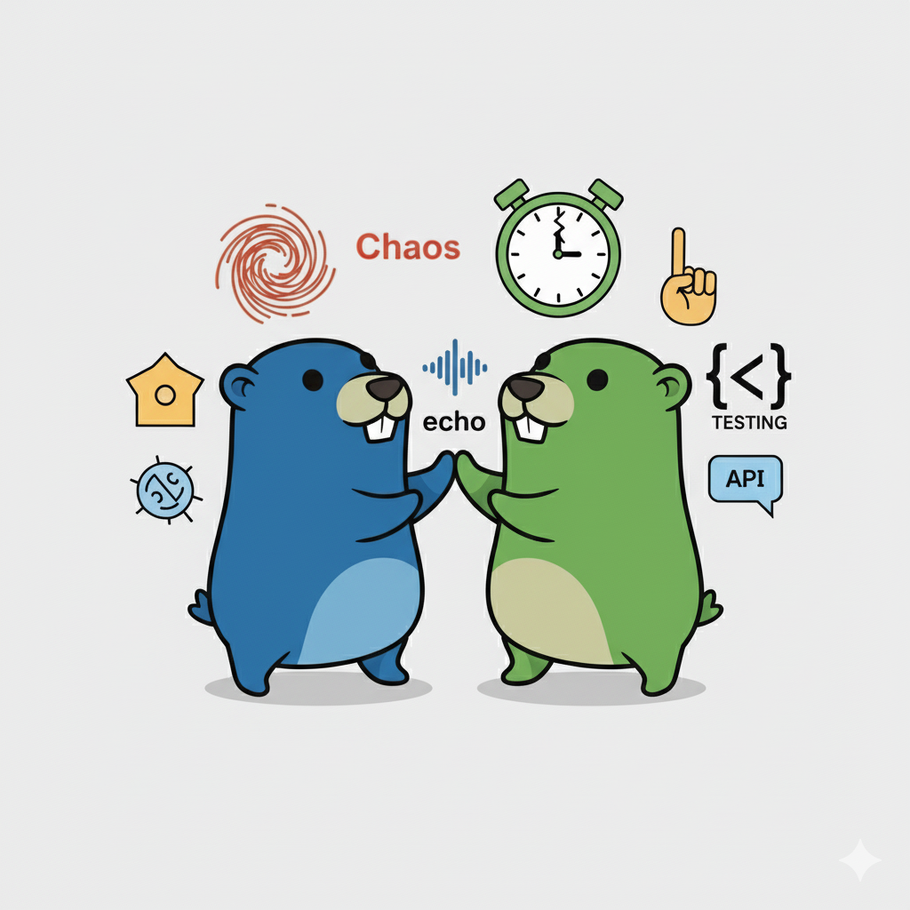

<h1 align="center">Advanced Echo Server</h1>

<p align="center">
  
</p>

[](https://goreportcard.com/report/github.com/arun0009/advanced-echo-server)
[](https://hub.docker.com/r/arun0009/advanced-echo-server)
[](https://opensource.org/licenses/MIT)
[](https://golang.org/)

> A powerful, feature-rich echo server designed for **API testing**, **load testing**, and **chaos engineering**

## Overview

Advanced Echo Server is a sophisticated Go-based testing tool that echoes requests or returns fully custom responses while providing extensive controls for simulating real-world conditions. It’s ideal for developers, DevOps engineers, and QA teams who need to test applications under a variety of scenarios, including retry logic, circuit breakers, latency, chaos injection, and distributed system failures.

With support for YAML-defined response sequences, request recording and replay, Prometheus metrics, WebSocket/SSE testing, and production-ready features like HTTP/2, TLS, CORS, and rate limiting, Advanced Echo Server provides a flexible environment for testing, debugging, and load-testing APIs.

### Key Benefits

- **Precise Control**: Fine-tune server behavior via HTTP headers, environment variables, or YAML scenarios
- **Chaos Engineering**: Inject failures, delays, rate limits, and complex failure patterns  
- **Load Testing**: Simulate high-latency responses and various error conditions
- **Developer Friendly**: Easy setup with Docker, comprehensive logging, and web interfaces
- **Production Ready**: HTTP/2 support, TLS, CORS, Prometheus metrics, and security features built-in
- **Request Replay**: Record and replay requests for debugging and testing

## Table of Contents

- [Quick Start](#quick-start)
- [Features](#features)
- [Configuration](#configuration)
- [Usage Examples](#usage-examples)
- [Web Interface](#web-interface)
- [Docker Usage](#docker-usage)
- [API Reference](#api-reference)
- [Contributing](#contributing)
- [License](#license)

## Quick Start

### Using Docker (Recommended)

```bash
# Pull and run the latest version
docker pull arun0009/advanced-echo-server:latest
docker run -p 8080:8080 arun0009/advanced-echo-server:latest

# Test it works
curl -X POST http://localhost:8080 -d '{"hello": "world"}'
```

### Using Go

```bash
# Clone and run
git clone https://github.com/arun0009/advanced-echo-server.git
cd advanced-echo-server
go run ./cmd/advanced-echo-server/main.go
```

### Using Docker Compose

```bash
# Clone repository
git clone https://github.com/arun0009/advanced-echo-server.git
cd advanced-echo-server

# Start with Docker Compose
docker-compose up -d
```

## Features

### Dynamic Control System

| Control Method | Usage | Priority |
|---|---|---|
| **HTTP Headers** | Per-request control | High |
| **Environment Variables** | Container-wide defaults | Medium |
| **YAML Scenarios** | Predefined response sequences | Low |

*Headers override environment variables, which override YAML scenarios*

### Testing Capabilities
- **Stateful Scenarios**: Define response sequences (e.g., [200, 500, 200]) for endpoints via YAML or API
- **Delay Simulation**: Simple, jitter, random, exponential and custom latency injection
- **Error Injection**: HTTP status codes, timeouts, random failures, and rate limits 
- **Chaos Engineering**: Configurable failure rates, error scenarios, and advanced patterns
- **Response Control**: Dynamic body size, content type, and headers
- **Request Analytics**: Detailed request and server metadata via `/info`
- **Request Recording**: Store last N requests in memory for review/replay
- **Observability**: Prometheus metrics for requests, errors, and latency

### Infrastructure Features

- **Security**: Automatic TLS certificate generation, CORS support
- **Modern Protocols**: HTTP/2 and H2C support
- **Containerized**: Multi-stage Docker builds for minimal image size
- **Web Interface**: Built-in WebSocket and SSE testing pages
- **Comprehensive Logging**: Request/response logging with configurable detail levels

## Configuration

### Environment Variables

| Variable | Description | Default | Example |
|---|---|---|---|
| `PORT` | Server listening port | `8080` | `PORT=9090` |
| `ENABLE_TLS` | Enable HTTPS | `false` | `ENABLE_TLS=true` |
| `CERT_FILE` | TLS certificate path | `server.crt` | `CERT_FILE=/certs/app.crt` |
| `KEY_FILE` | TLS private key path | `server.key` | `KEY_FILE=/certs/app.key` |
| `ENABLE_CORS` | Enable CORS headers | `true` | `ENABLE_CORS=false` |
| `LOG_REQUESTS` | Log request details | `true` | `LOG_REQUESTS=false` |
| `LOG_HEADERS` | Log all headers | `false` | `LOG_HEADERS=true` |
| `LOG_BODY` | Log request body | `false` | `LOG_BODY=true` |
| `MAX_BODY_SIZE` | Max request body size (bytes) | `10485760` | `MAX_BODY_SIZE=1048576` |
| `ECHO_HISTORY_SIZE` | Max requests to store in history | `100` | `ECHO_HISTORY_SIZE=50` |
| `ECHO_SCENARIO_FILE` | Path to YAML scenario file | `scenarios.yaml` | `ECHO_SCENARIO_FILE=/config/scenarios.yaml` |
| `ECHO_RATE_LIMIT_RPS` | Rate limit (requests/sec) | `0 (disabled)` | `ECHO_RATE_LIMIT_RPS=10` |
| `ECHO_RATE_LIMIT_BURST` | Rate limit burst size | `0 (disabled)` | `ECHO_RATE_LIMIT_BURST=20` |
| `ECHO_SSE_TICKER` | Interval for Server-Sent Events (SSE) in the `/sse` endpoint | `5s` | `ECHO_SSE_TICKER=500ms` |
| `ECHO_DELAY` | Simple delay for responses (supports `ms` suffix) | `""` | `ECHO_DELAY=50ms` |
| `ECHO_STATUS` | Force HTTP status code | `""` | `ECHO_STATUS=400` |
| `ECHO_ERROR` | Simulate specific error | `""` | `ECHO_ERROR=timeout` |
| `ECHO_CHAOS` | Random failure rate (%) | `""` | `ECHO_CHAOS=10` |

### Testing Controls

| Feature | HTTP Header | Environment Variable | Example Values |
|---|---|---|---|
| **Simple Delay** | `X-Echo-Delay` | `ECHO_DELAY` | `1000ms` (1 second) |
| **Random Delay** | `X-Echo-Random-Delay` | `ECHO_RANDOM_DELAY` | `100,500` (100-500ms) |
| **Latency Injection** | `X-Echo-Latency` | `ECHO_LATENCY` | `500ms`, `100-500ms` |
| **Force Status** | `X-Echo-Status` | `ECHO_STATUS` | `404`, `500`, `503` |
| **Simulate Error** | `X-Echo-Error` | `ECHO_ERROR` | `500`, `timeout`, `random` |
| **Chaos Rate** | `X-Echo-Chaos` | `ECHO_CHAOS` | `10` (10% failure rate) |
| **Custom Headers** | `X-Echo-Set-Header-*` | `ECHO_HEADER_*` | `ECHO_HEADER_X_Version=1.2.3` |

# Scenario Configuration (YAML)

Define response sequences in scenarios.yaml:

```yaml
- path: /api/test
  responses:
    - status: 200
      delay: 500ms
      body: '{"status": "ok"}'
    - status: 500
      delay: 1000ms
      body: '{"error": "internal"}'
    - status: 200
      delay: 100-500ms
      body: '{"status": "recovered"}'
```
*Note: Scenarios can also be set dynamically via the /scenario endpoint (see Usage Examples).*

## Usage Examples

### Basic Echo Test

```bash
# Simple echo
curl -X POST http://localhost:8080 \
  -H "Content-Type: application/json" \
  -d '{"message": "Hello, World!"}'
```

### Scenario Testing

```bash
# Define scenario via API
curl -X POST http://localhost:8080/scenario \
  -H "Content-Type: application/json" \
  -d '[{"path": "/api/test", "responses": [{"status": 200, "body": "{\"ok\": true}"}, {"status": 500}]}]'

# Test sequence
curl http://localhost:8080/api/test # Returns 200
curl http://localhost:8080/api/test # Returns 500
curl http://localhost:8080/api/test # Returns 200 (loops back)
```

### Chaos Engineering

```bash
# 20% chance of random failures
curl -X POST http://localhost:8080 \
  -H "X-Echo-Chaos: 20" \
  -d '{"test": "chaos engineering"}'

# Simulate rate limit
curl -X POST http://localhost:8080 \
  -H "X-Echo-Error: 429" \
  -d '{"test": "rate limit"}'

# Inject random latency
curl -X POST http://localhost:8080 \
  -H "X-Echo-Latency: 100-500ms" \
  -d '{"test": "latency"}'

# Exponential backoff (base 100ms, attempt 3)
curl -X POST http://localhost:8080 \
  -H "X-Echo-Exponential: 100,3" \
  -d '{"test": "backoff"}'
```

### Request History and Replay

```bash
# Send a request to record
curl -X POST http://localhost:8080 \
  -d '{"test": "record"}'

# View history (note the ID from response or history)
curl http://localhost:8080/history

# Replay to client (replace <id> with actual ID)
curl -X POST http://localhost:8080/replay \
  -H "Content-Type: application/json" \
  -d '{"id": "<id>"}'

# Replay to external target
curl -X POST http://localhost:8080/replay \
  -H "Content-Type: application/json" \
  -d '{"id": "<id>", "target": "http://other-service:8080"}'
```

### Load Testing Scenarios

```bash
# Simulate slow responses (2-second delay)
curl -X POST http://localhost:8080 \
  -H "X-Echo-Delay: 2000ms" \
  -d '{"test": "load testing"}'

# Random response times (100-500ms)
curl -X POST http://localhost:8080 \
  -H "X-Echo-Random-Delay: 100,500" \
  -d '{"test": "variable latency"}'
```

### Response Customization

```bash
# Add custom response headers
curl -X POST http://localhost:8080 \
  -H "X-Echo-Set-Header-X-App-Version: 1.2.3" \
  -H "X-Echo-Set-Header-X-Environment: staging" \
  -d '{"test": "custom headers"}'

# Force specific status code
curl -X POST http://localhost:8080 \
  -H "X-Echo-Status: 201" \
  -d '{"status": "created"}'

# Generate large response body (1MB)
curl -X POST http://localhost:8080 \
  -H "X-Echo-Response-Size: 1048576" \
  -d '{"test": "large response"}'
  ```

# Monitoring

```bash
# Access Prometheus metrics
curl http://localhost:8080/metrics

# Query request latency (example Prometheus query)
# Average latency over the last 5 minutes
rate(echo_request_duration_seconds_sum[5m]) / rate(echo_request_duration_seconds_count[5m])
```

## Web Interface

Access built-in testing interfaces:

- **WebSocket Client**: `http://localhost:8080/web-ws`
- **Server-Sent Events**: `http://localhost:8080/web-sse`

These interfaces provide interactive ways to test WebSocket connections and SSE streams directly from your browser.

## Docker Usage

### Basic Usage

```bash
# Run with default settings
docker run -p 8080:8080 arun0009/advanced-echo-server:latest

# Run with custom port
docker run -p 9090:9090 -e PORT=9090 arun0009/advanced-echo-server:latest
```

### Production Deployment

```bash
# Run with TLS and custom configuration
docker run -p 443:443 \
  -v /path/to/certs:/certs \
  -v /path/to/scenarios.yaml:/config/scenarios.yaml \
  -e PORT=443 \
  -e ENABLE_TLS=true \
  -e CERT_FILE=/certs/server.crt \
  -e KEY_FILE=/certs/server.key \
  -e ECHO_SCENARIO_FILE=/config/scenarios.yaml \
  -e ECHO_HISTORY_SIZE=50 \
  arun0009/advanced-echo-server:latest
```

### Docker Compose Example

```yaml
version: '3.8'
services:
  echo-server:
    image: arun0009/advanced-echo-server:latest
    ports:
      - "8080:8080"
    environment:
      - PORT=8080
      - ECHO_DELAY=500ms
      - ECHO_CHAOS=5
      - LOG_REQUESTS=true
      - ECHO_RATE_LIMIT_RPS=10
      - ECHO_RATE_LIMIT_BURST=20
      - ECHO_HISTORY_SIZE=50
      - ECHO_SSE_TICKER=500ms
      - ECHO_SCENARIO_FILE=/config/scenarios.yaml
    volumes:
      - ./certs:/certs
      - ./scenarios.yaml:/config/scenarios.yaml
```

## API Reference

### Endpoints

| Method | Path | Description |
|---|---|---|
| `ANY` | `/` | Main echo endpoint - accepts any HTTP method |
| `GET` | `/health` | Health check endpoint |
| `GET` | `/ready` | Readiness check endpoint|
| `GET` | `/info` | Server information and configuration |
| `GET` | `/web-ws` | WebSocket testing interface |
| `GET` | `/web-sse` | Server-Sent Events testing interface |
| `GET` | `/history` | View recorded requests |
| `POST` | `/replay` | Replay a stored request |
| `GET, POST` | `/scenario` | Manage response scenarios |
| `GET` | `/metrics`| Prometheus metrics |


## Contributing

We welcome contributions! Here's how you can help:

1. **Fork the repository**
2. **Create a feature branch**: `git checkout -b feature/amazing-feature`
3. **Commit your changes**: `git commit -m 'Add amazing feature'`
4. **Push to the branch**: `git push origin feature/amazing-feature`
5. **Open a Pull Request**

### Development Setup

```bash
# Clone your fork
git clone https://github.com/yourusername/advanced-echo-server.git
cd advanced-echo-server

# Install dependencies
go mod download

# Run tests
go test ./...

# Check test coverage
go test -coverprofile=coverage.out ./...
go tool cover -html=coverage.out -o coverage.html


# Run with live reload (requires air)
air
```

### Reporting Issues

Please use the [GitHub Issues](https://github.com/arun0009/advanced-echo-server/issues) page to report bugs or request features. Include:

- Go version
- Operating system
- Detailed description of the issue
- Steps to reproduce

## License

This project is licensed under the MIT License - see the [LICENSE](LICENSE) file for details.


## Stats


